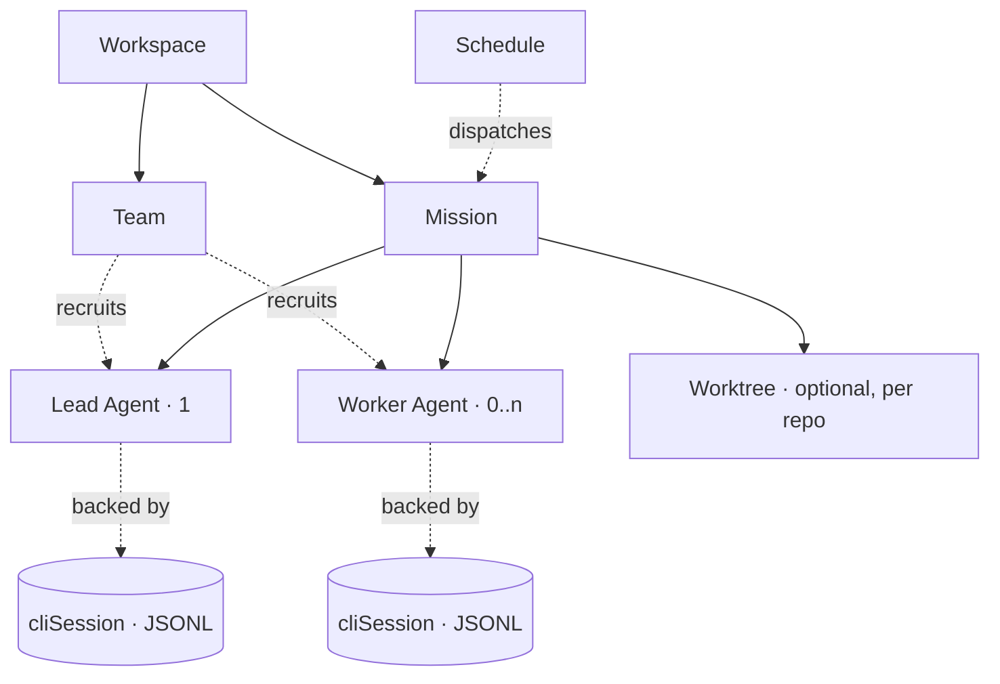

# OpenTeam Terminology System

Author: Product Strategist
Date: 2026-05-24
Status: **Approved** — naming locked, migration cadence = one-shot. Engineering kickoff next.

## TL;DR

Today the product uses four overlapping words for what is really one concept: `Task` (in routes + CTAs), `Chat` (in types + hooks), `Session` (in PTY/JSONL layer), and `Conversation` (in user-facing copy). Pick **one user-facing noun per concept**, align types and routes, leave the persistence layer alone.

**Recommended top-level mapping** (user-facing → today's code):

| User-facing term | Replaces | Definition |
|---|---|---|
| **Workspace** | Workspace | A project context — a repo (or repo group) plus the agent Team configured for it. |
| **Team** | Team / agentTeam | The set of Agents available within a Workspace. |
| **Agent** | Agent + ChatMember | The persona/role AND the unit of parallel work inside a Mission. A Mission with N Agents runs N parallel work streams. |
| **Mission** | Task, Chat | A unit of work the user dispatches. Has a goal, a Lead Agent, optional Worker Agents, a status, a deliverable. |
| **Skill** | Skill | A reusable capability bundle (prompts + hooks + allowed tools) loaded into Agents. |
| **Schedule** | CronJob | A trigger that dispatches a Mission on a cron / one-shot / interval rule. |

**One-line model:** *A user dispatches a Mission into a Workspace; the Mission's Lead Agent recruits Worker Agents from the Team, each Agent working in parallel, optionally calling Skills.*

---

## Why Mission (not Task)

Recap of the rationale agreed in the prior turn:

- **Semantic fit.** Mission carries "clear outcome + dispatchable + autonomous execution + multi-actor collaboration" — exactly the unit OpenTeam wants the user to think in. Task is generic and overloaded (it means "TODO item" in 80% of productivity apps).
- **Pulse-mode resonance.** "Dispatch a Mission, walk away, come back to review" reads naturally. "Run a Task" reads as a single-step action.
- **Brand differentiation.** Devin/Manus/Lindy all use "task" or "session." Mission is uncrowded and signals the OS-for-individuals positioning.
- **Composability.** Mission Control as the cross-workspace landing surface (already orphaned in `web/components/home/MissionControl.tsx`, see [IA Review F1/F2](../research/ia-review-2026-05-24.md)) becomes load-bearing rather than aspirational.

**Why not** Job / Run (too engineering), Project (too heavy, monthly cadence), Brief (describes the input, not the unit), Quest (too gamified), Workstream (enterprise-speak).

## Why no separate noun for "the per-Agent slice"

A previous draft proposed **Thread** for "one Agent's work inside a Mission." Dropped after review. Reasons:

1. **Semantic mismatch.** In Slack / email / GitHub, a Thread is a *branch off a parent message* — a reply chain. But an Agent's work in a Mission is the **trunk**, not a branch. Users reading "Thread" will look for a parent message to reply to; there is none.
2. **Wrong activity.** "Thread" implies messaging. Agents in OpenTeam *do work* — edit files, call tools, generate code. "Mission has 3 Threads" reads like 3 chat topics; "Mission has 3 Agents" reads like 3 workers in parallel, which is the actual model.
3. **Redundant with Agent.** Inside one Mission, Agent : per-agent-stream is **1 : 1**. Naming the stream separately doubles the vocabulary without adding a distinction. The Agent's name (Lead, QA, Designer) is already the natural handle.

**Resolution:** the user-facing language is just **Agent**. When context needs disambiguation between the Agent-as-persona and the Agent-as-participant-in-this-Mission, say "the Lead in this Mission" / "QA's work on Mission #42" — natural English, no neologism needed.

**Internally**, the participation record (today's `ChatMember`) becomes `MissionAgent` — a database row representing "this Agent's role + status + cliSession in this Mission." This is a code-level type, not a user-facing word.

**Why not:**
- *Thread* → branch metaphor + chat-app coding, both wrong (see above).
- *Session* → already overloaded internally (`cliSessionId`, `WorktreeSession`, `expertSessions`). Keep "session" as persistence-only.
- *Conversation* → fine as a fallback, but adds a noun for a concept that doesn't need its own. Saying "open the QA Agent" beats "open the QA Conversation."
- *Track / Lane / Workstream* → no real win over just "Agent."

---

## Hierarchy

**Cardinality:**
- Workspace `1 .. n` Mission
- Mission `1` Lead Agent `+` `0..n` Worker Agent (all run in parallel)
- Each Agent-in-Mission `1 : 1` cliSession (the JSONL file is the source of truth — [CLAUDE.md rule](../CLAUDE.md))
- Workspace `1 .. n` Schedule; Schedule `1 .. n` Mission (each fire creates a Mission)
- Agent (persona) `1 .. n` Mission — the same Agent persona can participate in many Missions over time

---

## Verb vocabulary

Pair a consistent action with each noun so docs and UI copy stop drifting:

| Verb | Object | Used when |
|---|---|---|
| **Dispatch** | a Mission | User starts a new Mission (replaces "create task", "new chat") |
| **Hand off** / **Delegate** | to an Agent | Lead Agent assigns a sub-task to a Worker (opens a new Thread) |
| **Resume** | a Mission / Thread | User returns and continues |
| **Pin** / **Archive** | a Mission | Sidebar housekeeping |
| **Schedule** | a Mission | Create a recurring trigger |
| **Recruit** | an Agent (into a Mission) | Pull a Team member into the active Mission |

**Avoid:** "run" (engineering-y), "kick off" (informal), "spin up" (infra-y), "open a chat" (collides with chat apps).

---

## UI surface mapping

What renames where:

| Surface | Today | After |
|---|---|---|
| Sidebar primary CTA | `+ New Task` (⌘N) | `+ New Mission` (⌘N) |
| Sidebar list section | (untitled tasks list) | "Missions" |
| Route | `/workspace/:wid/task/:tid` | `/workspace/:wid/mission/:mid` |
| Toolbar breadcrumb | `[Workspace · Task · Agent]` | `[Workspace · Mission · Agent]` |
| Toolbar info bar | "Task Chat" / "GROUP" | "Mission · N Agents" |
| Cross-workspace landing | `/` redirect (orphaned MissionControl) | `/` → **Mission Control** (loads `home/MissionControl.tsx`) |
| Archive page | `/chats` | `/missions/archive` (or merge into Mission Control filters) |
| View-mode toggle | URL `?agent=ID` implicit | Segmented `[Mission view | Agent view]` |
| Resource page | "Schedules" / "Cron Jobs" | "Schedules" (drop "Cron") |
| Notifications copy | "Task completed" | "Mission completed" |

---

## Code rename plan (one-shot, mechanical)

Scope is wide but mostly safe with TypeScript — one PR per layer, in this order:

### Phase 1 — Shared types (`shared/`)
| Old | New |
|---|---|
| `Chat` | `Mission` |
| `ChatMember` | `MissionAgent` |
| `ChatMemberStatus` | `MissionAgentStatus` |
| `ChatMemberRole` | `MissionAgentRole` |
| `ChatStatusChangedPayload` | `MissionStatusChangedPayload` |
| `ChatActivityPayload` | `MissionActivityPayload` |
| `ChatPermissionRequestPayload` | `MissionPermissionRequestPayload` |
| `ChatPermissionResolvedPayload` | `MissionPermissionResolvedPayload` |
| `TaskStatus` | `MissionStatus` (already user-facing, fold the two together) |
| `TaskSummary` | `MissionSummary` |
| `TaskEnvelope` (agent-message) | keep — internal A2A envelope, not the same concept |

### Phase 2 — Server (`server/`)
| Old | New |
|---|---|
| `ChatService` | `MissionService` |
| `useChatStore` (server-side) | `useMissionStore` |
| `chatRoutes.ts` | `missionRoutes.ts` |
| DB table `chats` | `missions` (migration: rename + view alias for one release) |
| Column `chat_id` | `mission_id` |
| WS channel `chat.*` | `mission.*` |

### Phase 3 — Web (`web/`)
| Old | New |
|---|---|
| `useWorkspaceChats` | `useWorkspaceMissions` |
| `useAllChats` | `useAllMissions` |
| `TaskSessionList` | `MissionList` |
| `WorkspaceContent` task-overview mode | "Mission view" |
| Route param `taskId` | `missionId` |
| Component dir `web/components/task/` | `web/components/mission/` |

### Phase 4 — JSONL persistence layer
**No rename.** `cliSessionId`, `expertSessions`, `WorktreeSession`, PTY "session" — these stay. They are the persistence/transport layer and never surface in UI.

### Phase 5 — Agent-pane component naming
| Old | New |
|---|---|
| Visual pane for one Agent in Quad/Split layout | `AgentPane` (was various) |

(No new user-facing noun introduced — the pane visualizes one Agent's work; "Agent" is already the right word.)

---

## Migration approach

1. **PR 1 — Naming RFC merged** (this doc). Lock the vocabulary; no code changes yet.
2. **PR 2 — Shared types rename** (Phase 1). Pure mechanical; TS catches all call sites.
3. **PR 3 — Server + DB migration** (Phase 2). Add `missions` table as a rename of `chats`, keep a view for one release in case of rollback. WS events get aliased for one release.
4. **PR 4 — Web rename + route redirects** (Phase 3 + Phase 5). Add `/task/*` → `/mission/*` 301-style client redirect. Keep redirect for at least one release.
5. **PR 5 — Copy + docs sweep**. README, AGENTS.md, openspec specs, marketing site.
6. **PR 6 — Drop aliases**. Remove WS event aliases, route redirects, view aliases. Single clean codebase.

Total effort estimate: ~3–5 engineering days spread across 2 weeks, plus a half-day for docs/copy.

---

## What we explicitly do NOT rename

- **Workspace** — already correct; means "project context."
- **Agent** — already correct; the persona.
- **Team** — already correct; the agent roster of a Workspace.
- **Skill** — already correct.
- **Schedule** — already correct (drop "Cron" prefix where it leaks into UI; keep `cron` as the expression syntax).
- **Worktree / Repository** — internal git concepts, never surfaced as primary nouns.
- **cliSession / PTY session** — persistence/transport layer, no user-facing collision after Thread renames the user-facing slice.

---

## Decisions (locked 2026-05-24)

- **Mission** chosen as the user-facing noun for the unit of work. (Beat: Brief, Task, Job, Run, Project, Quest.)
- **No separate noun** for the per-Agent slice inside a Mission — use "Agent" directly. (Rejected: Thread, Conversation, Session, Track.)
- **MissionAgent** is the internal code-level type for the participation record (renames `ChatMember`).
- **One-shot migration**: Phase 1–4 ship in the same week to avoid terminology drift across releases. Aliases (DB view, WS event names, URL redirects) live for exactly one release window, then drop in Phase 6.

## Remaining open question

- **Marketing alignment.** README, landing page, demo videos all say "Task" today. Does the rename need to coordinate with an external launch moment, or can we ship product-first and update copy in a follow-up? (Owner: user)

---

## Related work

- [IA Review 2026-05-24](../research/ia-review-2026-05-24.md) — F5 flagged the terminology fragmentation; this PRD is the response.
- `web/components/home/MissionControl.tsx` — orphaned today; this rename makes its name load-bearing and unblocks IA F1.
- `openspec/changes/` — proposals authored after this PRD lands should adopt the new vocabulary.
